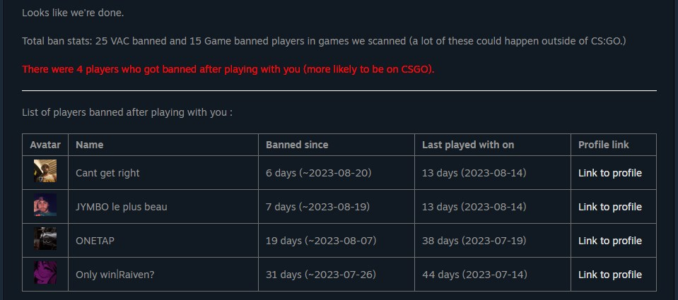
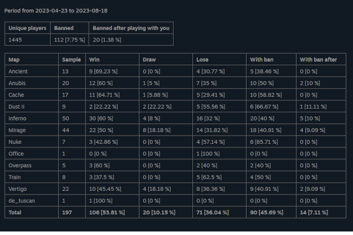
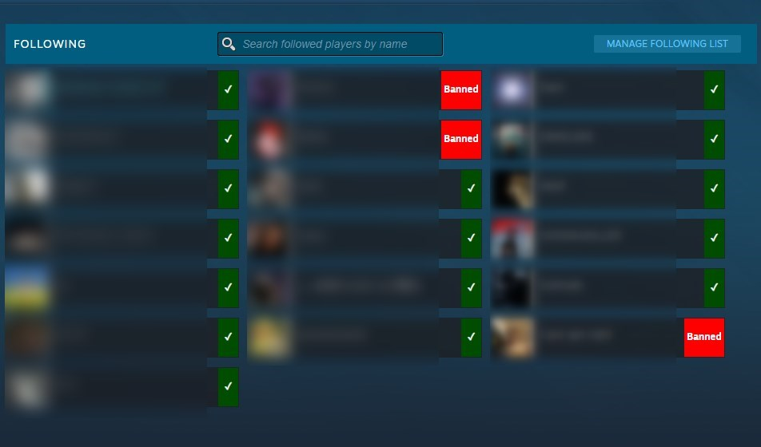
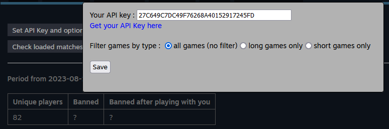

# CSGO history ban checker

This is a fork of [Ban-Checker-for-Steam](https://github.com/ge-ku/Ban-Checker-for-Steam).

The extension is published for [Chrome](https://chrome.google.com/webstore/detail/csgo-history-ban-checker/pniajbbemhplaefaikpgfipmopopjeob) and [Firefox](https://addons.mozilla.org/fr/firefox/addon/csgo-history-ban-checker/).

I focus on improving analysing about https://steamcommunity.com/my/gcpd/730

Load your matchmaking history and find if players have been banned (VAC or Game ban). You can filter your games between short and long games.

I provide the list of banned players after playing with you and some statistics.

The most important statistics I wanted to add in the first place :
- number and pourcentage of matches with someone who has been banned after playing with you,
- number and pourcentage of players who has been banned after playing with you.

I remove all the functionnalities about alarms and notifications.  
I keep the friends list and followed players ban check. No group members check though.

What this version add to the original version :
- number and pourcentage of matches with someone who has been banned after playing with you,
- number and pourcentage of players who has been banned after playing with you.
- you can stop the history load and and ban check,
- you can provide a max date for history load,
- list of players banned,
- maps statistics,
- winrate,
- add option to filter games between short and long games.

Here are some screeshots :

