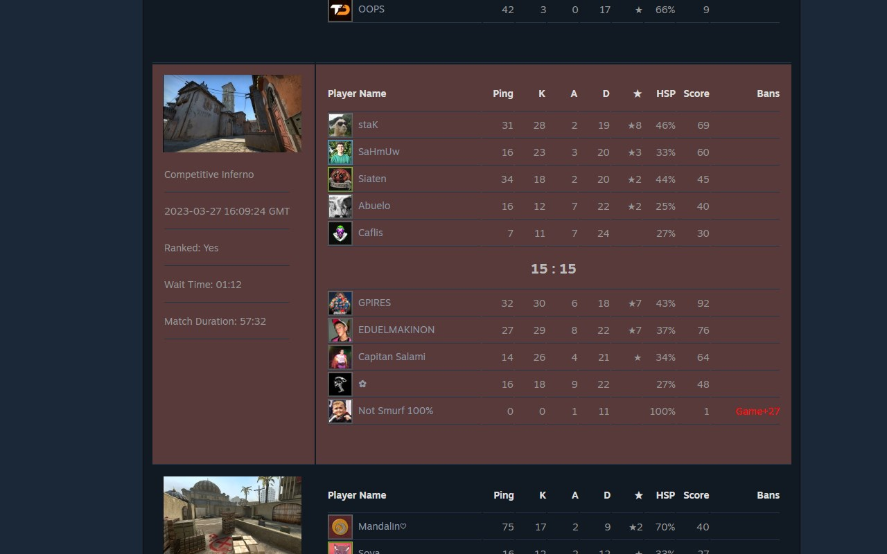
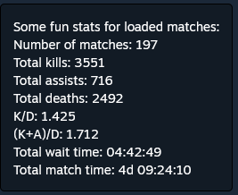

# CS2 and CSGO history ban checker

This is a fork of [Ban-Checker-for-Steam](https://github.com/ge-ku/Ban-Checker-for-Steam).

The extension is published for [Chrome](https://chrome.google.com/webstore/detail/csgo-history-ban-checker/pniajbbemhplaefaikpgfipmopopjeob) and [Firefox](https://addons.mozilla.org/fr/firefox/addon/csgo-history-ban-checker/).

I focus on improving analysing about https://steamcommunity.com/my/gcpd/730

Load your matchmaking history and find if players have been banned (VAC or Game ban).

I provide the list of banned players after playing with you and some statistics.

The most important statistics I wanted to add in the first place :
- number and pourcentage of matches with someone who has been banned after playing with you,
- number and pourcentage of players who has been banned after playing with you.

I remove all the functionnalities about alarms and notifications.  

I add since 1.2.1 the ban status check about friends list, followed players, recently played with, and group members page like in the original extension.

What this version add to the original version :
- number and pourcentage of matches with someone who has been banned after playing with you,
- number and pourcentage of players who has been banned after playing with you.
- you can stop the history load and and ban check,
- you can provide a max date for history load,
- list of players banned,
- maps statistics,
- winrate.

Here are some screeshots :

;

TODO list :
- sort tables features
- no need to rescan when changing game type