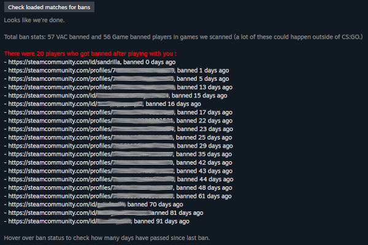

# CSGO history ban checker

This is a fork of [Ban-Checker-for-Steam](https://github.com/ge-ku/Ban-Checker-for-Steam).

The extension is published for [Chrome](https://chrome.google.com/webstore/detail/csgo-history-ban-checker/pniajbbemhplaefaikpgfipmopopjeob) and [Firefox](https://addons.mozilla.org/fr/firefox/addon/csgo-history-ban-checker/).

I focus for now on improving analysing about https://steamcommunity.com/my/gcpd/730

Load your matchmaking history and find if players have been banned (VAC or Game ban). You can filter your games between short and long games.

I provide statistics for playerbase and maps. The most important statistics I wanted to add in the first place :
- number and pourcentage of matches with someone who has been banned after playing with you,
- number and pourcentage of players who has been banned after playing with you.

Bans after the game displayed in red are more likely to be for CSGO. Older ones (yellow) can't be on CSGO.

I remove all the functionnalities about alarms and notifications.  
And I remove for now the friends/group/followed players ban check. May add it back in future version.

What this version add to the original version :
- you can stop the history load and input a "max date" for history load,
- more statistics,
- add option to filter games between short and long games.

Here are some screeshots :

