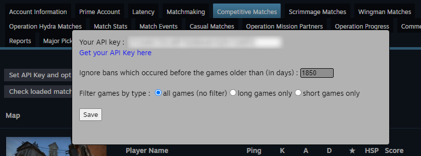
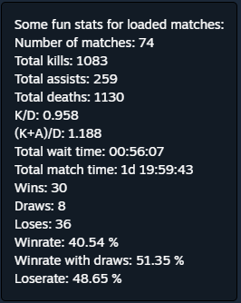
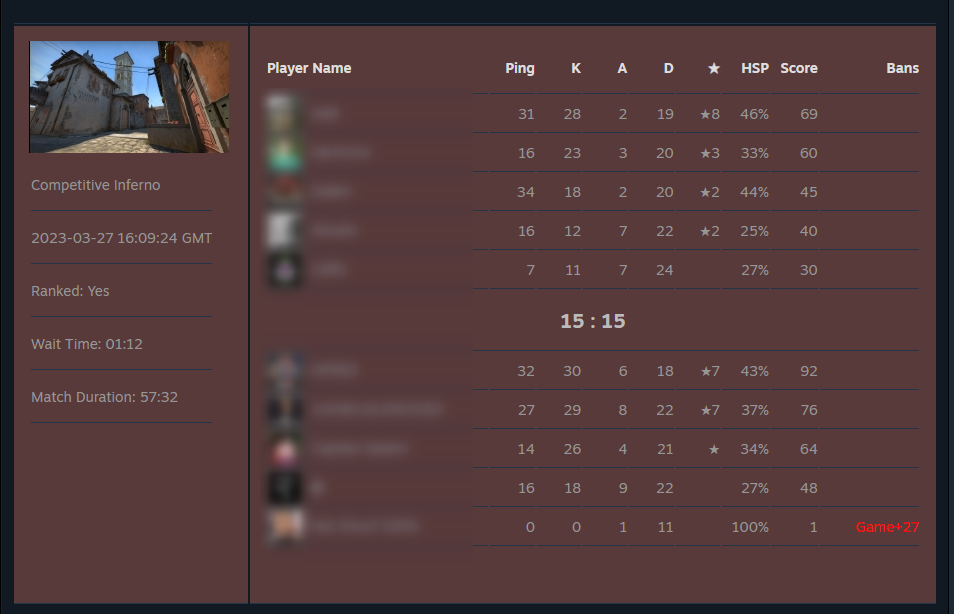

# CSGO match history ban checker

This is a fork of [Ban-Checker-for-Steam](https://github.com/ge-ku/Ban-Checker-for-Steam).

Load your matchmaking history and find if players have been banned (VAC or Game ban). You can filter your games between short and long games and ignore old bans for statistics.

I provide two main statistics at the end of scan :
- number and pourcentage of matches with someone who has been banned after the game (more probably on CSGO),
- number and pourcentage of players who has been banned after the game (more probably on CSGO).

You will find some personal statistics like K/D and winrate at the bottom left. I just add winrate and fix some NaN cases.

I remove all the functionnalities about alarms and notifications.

And I remove for now the friends/group/followed players ban check. May add it back in future version.

I focus for now on improving analysing about https://steamcommunity.com/my/gcpd/730

What this version add to the original version :
- you can stop the history load and input a "max date" for history load.
- add winrate statistic in the bottom left block
- add statistics about cheater pourcentage / match with cheater poucentage at the end of the scan.
- add some options like filter games between short and long games or ignore very old bans in statistics result (bans which occured before you play with the player).

The extension for Chrome and Firefox are waiting for validation.

I will provide links after.

Here are some screeshots :

