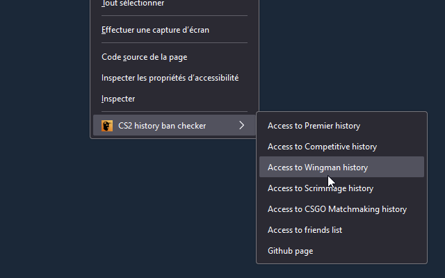
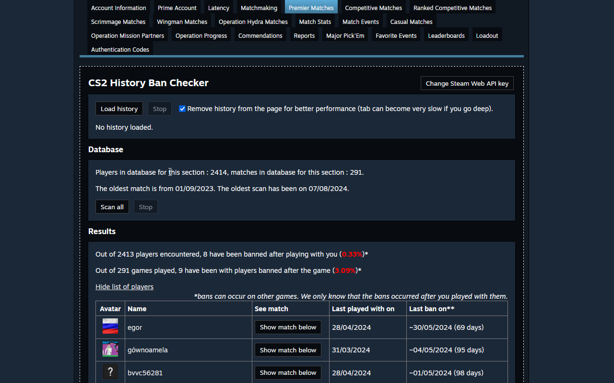
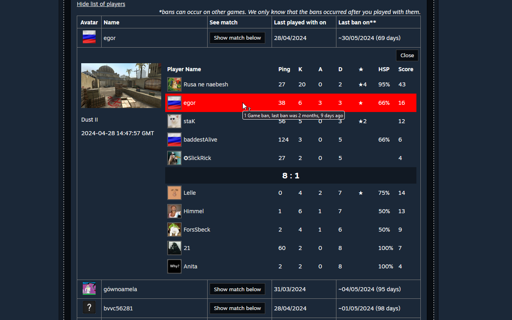
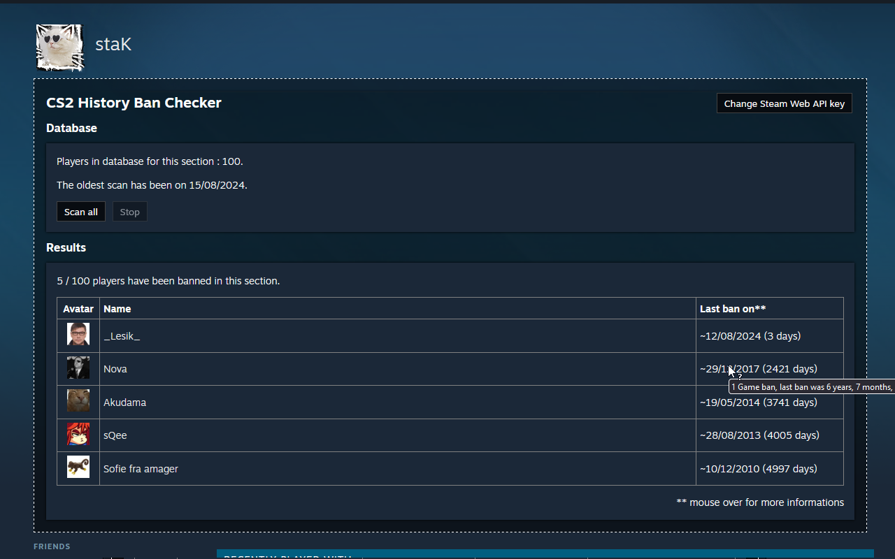

# CS2 history ban checker

Load your match history and find if players have been banned after playing with you.
You can check if players have been banned on friends, followed, blocked and other "people" pages.

Right click anywhere on any webpage and you will see the menu to access directly to your match history or friends list. You need to be logged to steam to access to your personal history.

You will see the list of banned players and you can see the last match played with them. We keep results in local database so that you don't have to reload the history.

CS2 history ban checker does not send or share any user data to the developer of extension and third-party. Extension communicates with Steam servers directly. All data are stored locally into the browser.

We keep results in local database to avoid reloading the history every time.  
Read the [privacy policy](./privacy-policy.md) for more information about it.

The extension is published for [Chrome](https://chromewebstore.google.com/detail/pniajbbemhplaefaikpgfipmopopjeob) and [Firefox](https://addons.mozilla.org/fr/firefox/addon/cs2-history-ban-checker/).

