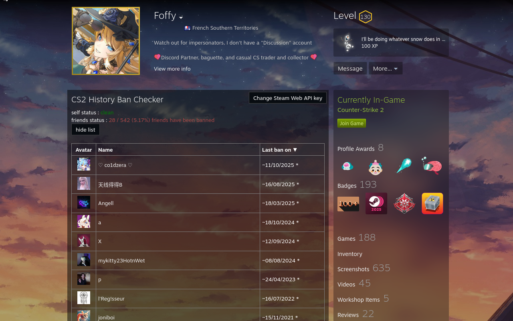
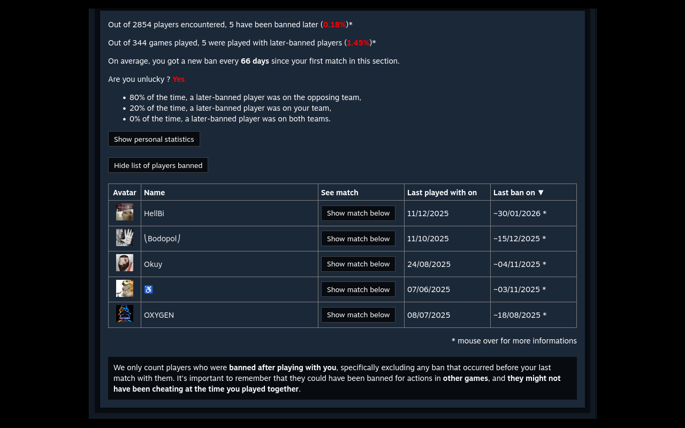

# CS2 ban checker

You can check ban status on Steam profiles and get a list of banned friends.

On top of that, load your match history and find if players have been banned after playing with you.

Access your match history directly with a right click on any web page\*

You will see the list of banned players and you can see the last match played with them. We keep results in a local database so that you don't have to reload the history.

CS2 ban checker does not send or share any user data to the developer of the extension or any third party. The extension communicates with the Steam API directly. All data is stored locally in the browser.

\* You need to be logged in to Steam to access your personal history.

The extension is published for [Chrome](https://chromewebstore.google.com/detail/pniajbbemhplaefaikpgfipmopopjeob) and [Firefox](https://addons.mozilla.org/fr/firefox/addon/cs2-history-ban-checker/).

